# EtherSentinel - Blockchain Security Analysis System

> 2025年中国机器人及人工智能大赛 人工智能赛道 作品
>
> 可以访问我们的 [作品主页](https://andyqiu2004.github.io/EtherSentinel/) 来了解更多信息


## 项目背景
---

该项目关注**区块链**在**去中心化金融（DeFi）**领域的**安全问题**，特别是在过去几年中，**区块链安全事件**的频发性和**恶意攻击**所带来的重大**财务损失**。从图表中可以看到，2020年到2023年之间，区块链安全事件频繁发生，且许多事件的损失金额巨大。例如，2020年的**Warp Finance**和2021年的**Poly Network**事件是其中的重大安全事件。这些攻击带来了令人震惊的财务损失，尤其是在2020和2021年，恶意行为对**DeFi平台**的影响尤为严重。

目前，区块链安全检测方案面临几个挑战。首先，检测方法难以有效表达多样化的**风险行为**，尤其是在针对不同类型恶意行为时，检测特征相对较少。其次，现有的检测方案无法实现**高效**且**快速的检测**，导致难以应对不断变化的攻击方式。最后，**跨平台的安全检测**也是一大难题，尤其是在多个去中心化平台之间，如何有效整合检测系统来识别潜在风险，仍然是一个需要解决的复杂问题。

此外，区块链技术的**战略重要性**已经被越来越多的国家所认识。特别是在**中国**，区块链技术在国家层面受到了高度重视。习近平总书记在2019年提出将区块链作为核心技术自主创新的重要突破口，并在2021年将区块链写入了《中华人民共和国国民经济和社会发展第十四个五年规划和2035年远景目标纲要》，这标志着区块链技术将成为未来国家发展的**关键组成部分**。  

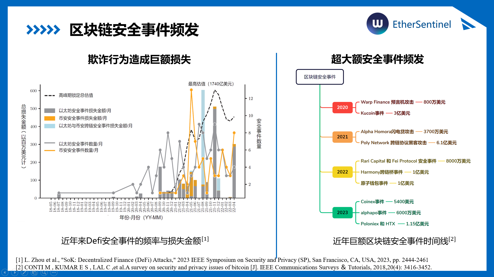


## 去中心化金融带来的挑战
---

由于去中心化金融的开放性和低门槛，恶意合约、钓鱼攻击、欺诈交易等问题频频出现。攻击者通常通过合约漏洞或者伪装行为进行非法操作，给用户带来了巨大的经济损失。近年来，随着区块链应用的规模不断扩大，攻击手段变得更加复杂和多样化，带来了更大的安全风险。

当前的安全检测方案面临多个挑战。首先，欺诈行为手段多样，且结构复杂，现有的检测方法往往难以有效捕捉这些多变的攻击特征。其次，不同平台的生态系统差异使得跨平台的安全检测尤为困难，导致现有系统难以兼容多个区块链平台，且很难实现统一的风险识别。最后，由于数据特征不足，现有检测方案往往面临识别困难、检测精度低的问题。

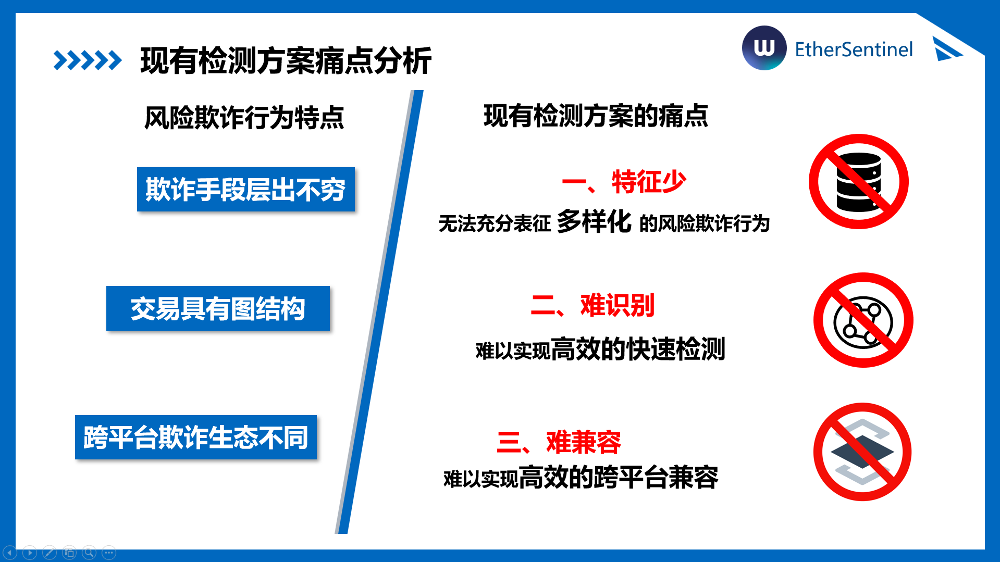

由于欺诈手段多样，攻击的识别难度极高，传统的防御手段在面对这些新型威胁时显得力不从心。因此，迫切需要一个更加智能化且高效的解决方案，以应对这些新的安全挑战。


## EtherSentinel的解决方案
---
面对传统欺诈攻击检测方案的缺陷，以太哨兵团队分别提出了TrxNet图构建方法、基于GNN-Transformer的异常判别架构，以及跨平台高效兼容模块，全面提升区块链风险行为识别的准确性和实用性。
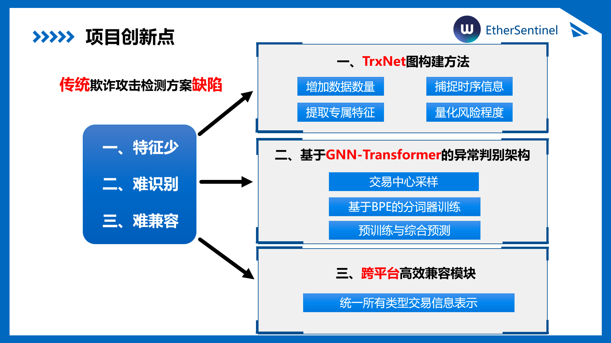

### 基于TrxNet的图构建方法
传统的欺诈检测方法面临着数据量少、特征难以提取、模型准确率低等问题。为了解决这些问题，EtherSentinel提出了一种基于**TrxNet**的图构建方法。这种方法可以：
- **增加数据量**：通过多种数据扩增技术，增强模型的训练数据，提高模型的泛化能力。
- **提取专属特征**：针对不同类型的交易行为，提取更加精准的交易特征，从而提高分类和识别的准确性。
- **捕捉时序信息**：通过对交易的时序数据进行建模，能够更好地识别交易过程中的潜在风险。
- **量化风险程度**：对每一笔交易进行风险评估，帮助判别是否为欺诈行为，并量化欺诈的严重程度。

### 基于GNN-Transformer的异常判别框架
针对传统模型在复杂交易环境下表现出的不足，EtherSentinel提出了基于**GNN-Transformer**的异常判别框架。这个框架的核心优势在于：
- **交易中心采样**：通过聚焦交易中心，能够有效识别异常模式，减少无关信息的干扰。
- **基于BPE的分词器训练**：采用BPE（Byte Pair Encoding）技术对交易信息进行精细的分词训练，有效捕捉交易中的关键信息，优化特征表示。
- **预训练与综合预测**：结合预训练模型和综合预测算法，进一步提升模型的准确性和鲁棒性，能够在实时交易中有效识别欺诈行为。

### 跨平台高效容错模块
为了提高系统的稳定性和适应性，EtherSentinel还设计了一个跨平台的高效容错模块。这一模块可以：
- **统一所有交易信息的展示**：通过统一的接口和展示模块，使得不同类型的交易信息可以在一个平台上进行统一管理和展示，简化了交易监控和数据分析的复杂度。
- **高效容错机制**：在数据传输或处理出现问题时，能够快速恢复并保证系统的高可用性，从而确保交易过程中的实时性和准确性。


## 系统核心技术
---

### 1. TrxNet：欺诈数据集构建及特征提取方法  
本团队和metatrust lab合作，构建了更加全面的TrxNet数据集，  
我们设计了一种增强型交易图构建策略。在原始交易数据基础上，融合调用日志、Goplus安全报告等高语义安全信息，同时引入时间戳、金额等交易元数据，丰富节点和边的属性。  
采用基于时间窗口的多轮邻近扩展策略，构建紧密关联的高价值子图。这种多维建模方式提高了图结构的表达能力，解决了特征少、表征不充分的难题。
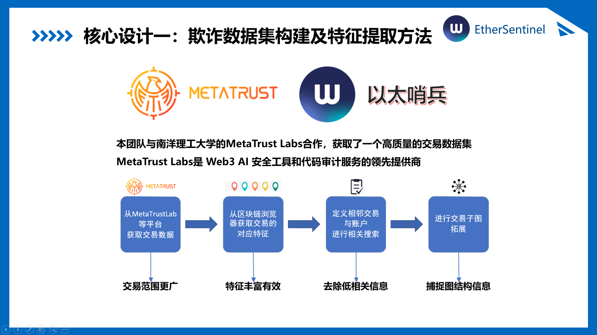
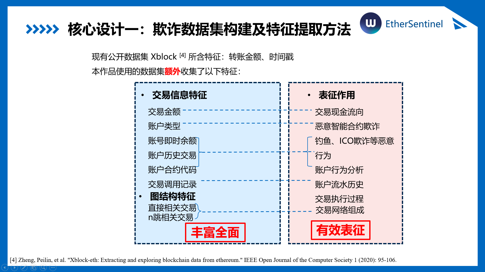
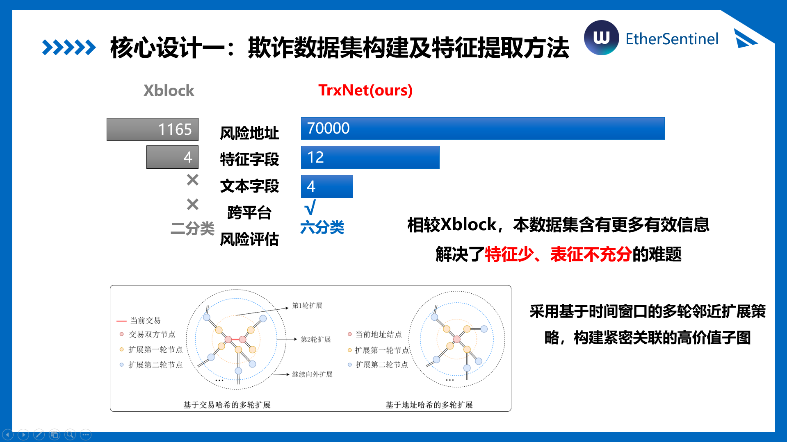

### 2. GNN-Transformer的异常判别架构  
GNN网络聚合特征，transformer负责建模全局交易顺序与依赖关系，实现对于子图进行结构与时序双重建模。

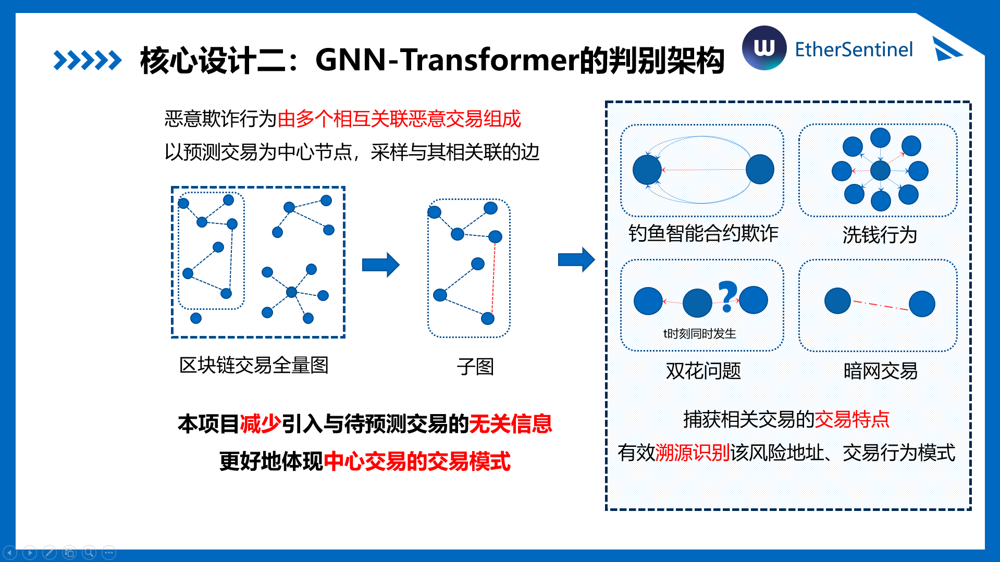
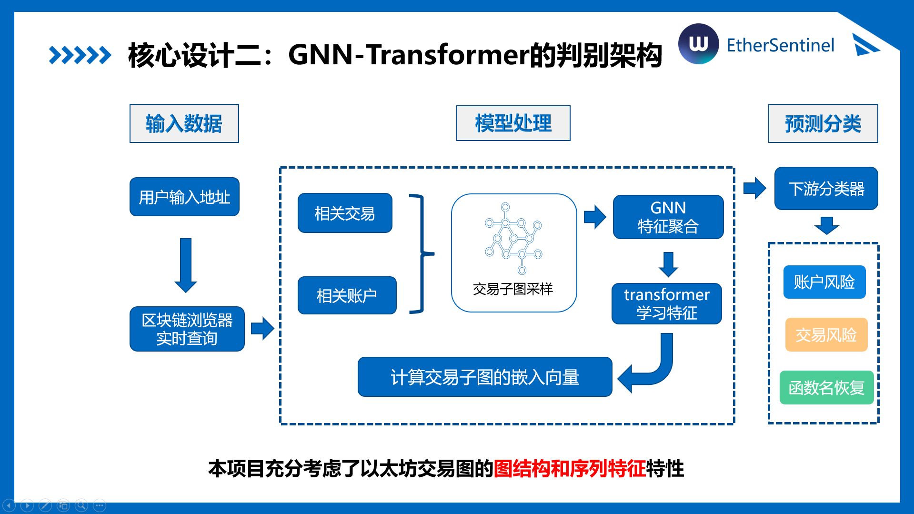

### 3. 面向多源异构信息的统一表征与下游任务迁移  
本项目总共从区块链平台上获得了20万张交易子图，将子图信息进行BPE无监督表征学习，充分考虑统一表示的文本信息特征，结合预训练技术，实现高效的下游任务迁移。  


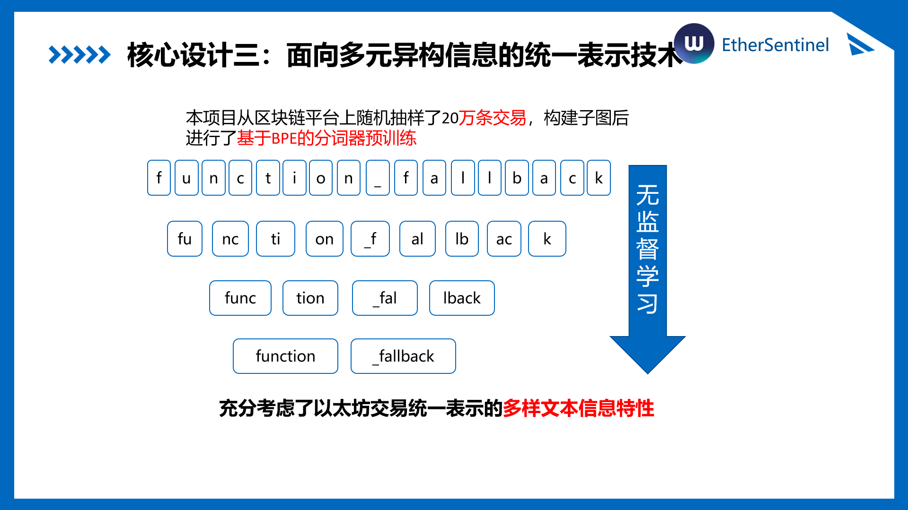
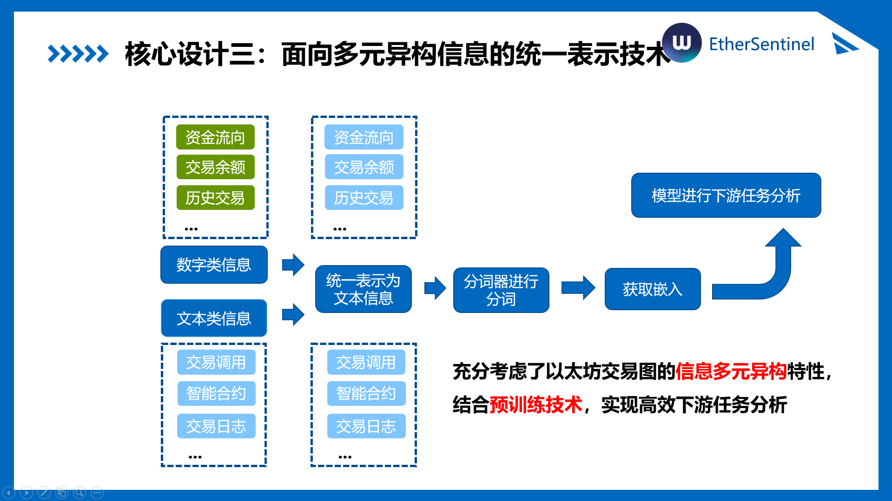
至此，以太哨兵团队完成了TrxNet搭建，GNN-Transformer体系，以及预训练-跨平台下游任务的全套系统搭建。  
提供交易数据实时追踪、交易风险分析、账户风险分析、代码函数名生成功能，为用户提供多种维度的风险信息。


## 研究成果与应用
---

### 1. 数据集与对比测试  
下游任务数据集方面，以太哨兵团队从五大主流区块链：BSC、Ethereum、Polygon、Fantom、Arbitrum收集了7万余条下游任务信息，对比了众多优秀的相关作品，包括BERT for ETH，CODEBERT，GraphCodeBERT，XBlockFlow 等同行业领先作品。  
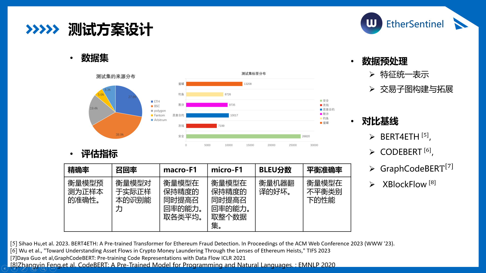
### 2. 实验结果  
我们的作品在**账户风险检测**与**合约函数名恢复**方面的效果均达到领先水平。团队对账户行为进行深度表征，在风险账户识别任务中取得85%的准确率。  

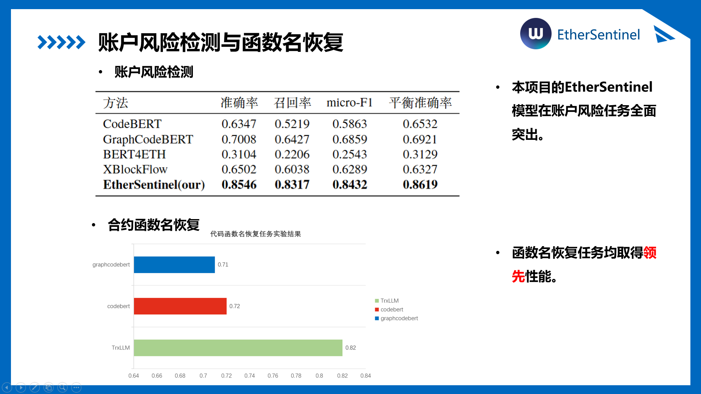

同时，平台支持对混淆智能合约函数名的自动恢复，BLEU指标达到0.82，全面优于基线。  

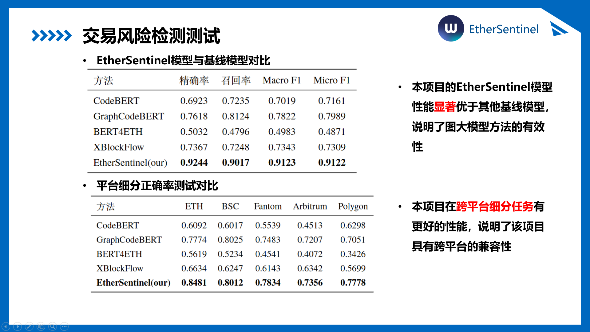

在交易风险分析和跨平台迁移实验，对于链上异常交易检测，模型达到了92%的准确率，误报率低于5%。  
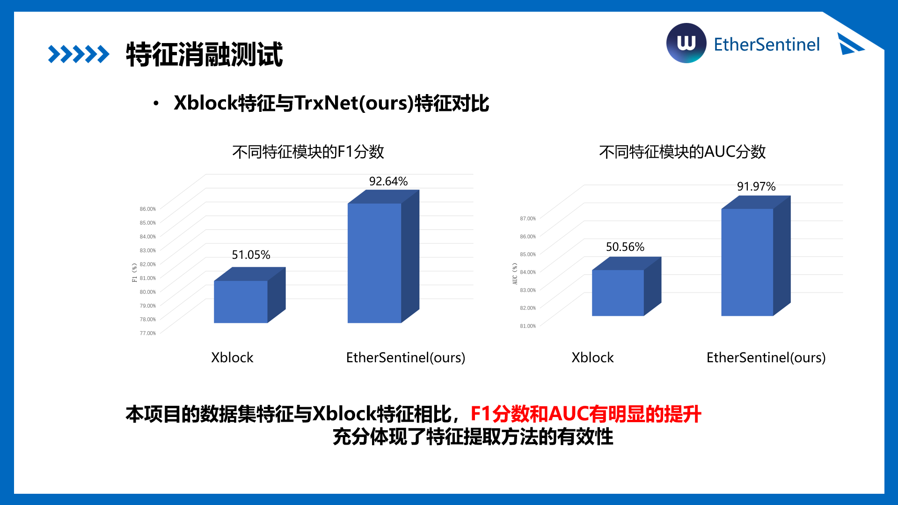

在跨平台实验下，对于不同链的交易结构、合约标准和攻击策略下均保持良好表现，展现出极强的跨链兼容性与部署效率，具备广泛的实用潜力。

### 3. 模型调优与数据基准  
团队进行广泛的参数灵敏度测试，精心设计，逐步调优，训练出一千余G的预训练模型簇，旨在不留余力找到最优模型！  
本项目的数据集特征与Xblock特征相比，F1分数和AUC有明显的提升，充分体现了特征提取方法的有效性，验证了团队数据基准的可靠性！

## 项目细则
---

### 功能

1. **交易分析**
   - 交易流中的模式识别
   - 异常检测
   - 智能合约交互分析

2. **账户分析**
   - 账户行为分析
   - 风险评分
   - 历史活动分析

3. **实时监控**
   - 实时交易监控
   - 即时威胁检测
   - 警报系统

### 项目结构

```
EtherSentinel/
├── models/                 # 训练模型和模型定义
├── data/                  # 数据存储和处理
├── src/                   # 源代码
│   ├── analysis/         # 分析模块
│   ├── models/           # 模型架构
│   ├── utils/            # 工具函数
│   └── monitoring/       # 实时监控
├── config/               # 配置文件
├── notebooks/            # 分析用 Jupyter 笔记本
└── tests/               # 单元测试
```

### 安装

1. 克隆代码库
2. 安装依赖项：
```bash
pip install -r requirements.txt
```

### 使用

1. 配置您的环境变量（.env 文件）
2. 运行分析：
```bash
python src/main.py
```

### 模型训练

GNN-BERT 模型可以通过以下命令进行训练：
```bash
python src/train.py
```

### 许可证

MIT 许可证
